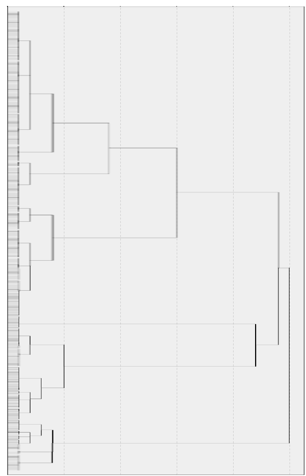
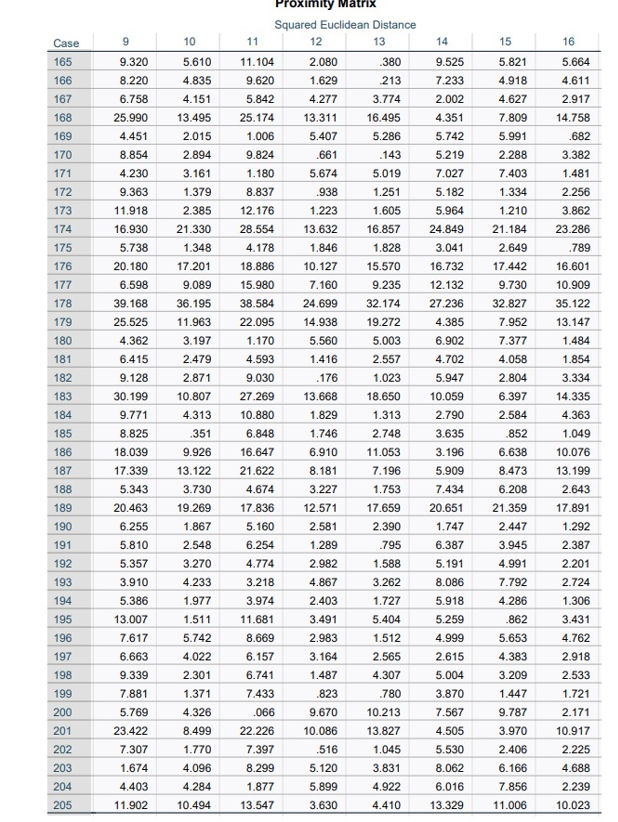
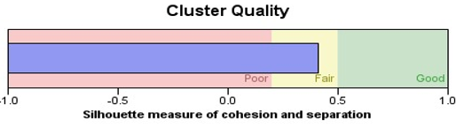
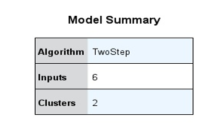
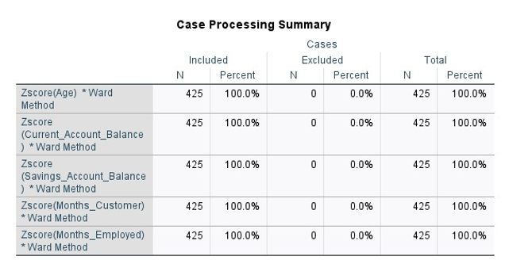

# 🧠 Customer Segmentation Using Cluster Analysis (SPSS)

This project demonstrates unsupervised clustering techniques applied to a UK bank's customer dataset. The primary aim is to segment customers into distinct groups based on demographic and financial behavior, enabling data-driven marketing and service personalization.

---

## 📊 Project Summary

We applied **Hierarchical Clustering** and **Two-Step Clustering** using SPSS to identify natural customer segments. Key objectives:

- Discover distinct customer profiles.
- Understand variable contributions to cluster formation.
- Use clustering results to recommend marketing strategies.

---

## 📁 Dataset Description

**Source:** Simulated UK bank customer dataset (425 records)

**Variables Used for Clustering (standardized via Z-scores):**
- `Age`
- `Current Account Balance`
- `Savings Account Balance`
- `Months as Customer`
- `Months Employed`

---

## 🧮 Clustering Techniques

### 1. **Hierarchical Clustering**
- Method: **Ward’s Method**
- Distance Metric: **Squared Euclidean**
- Output: [Dendrogram](images/Dendogram.png)

📌 **Result:**
- 4 clusters identified
- Visual splits observed in dendrogram at sharp linkage jumps

🔢 **Proximity Matrix (Top View)**  
(Excerpt from squared Euclidean distance between select cases)

---

### 2. **Two-Step Clustering**
- Distance: **Euclidean**
- Auto-clustering: Enabled
- Output: [Cluster Quality](images/Cluster_quality.png), [Model Summary](images/Model_summary.png)

📈 **Cluster Quality:**
- Silhouette Score: ~0.4 (**Fair**)

📊 **Model Summary:**

---

## 🧠 Cluster Insights

### 🔍 Cluster Profiles:

| Cluster | Description |
|--------|-------------|
| **1** | Younger customers, low balances, short job tenure |
| **2** | Mature, high-income customers with long tenure |
| **3** | Mid-aged customers with moderate finances |
| **4** | High current balance, but low savings and tenure |

📋 **Case Processing Summary**  
All 425 records included and processed:

---

## 🧩 Strategic Recommendations

- **Cluster 2:** Target with premium and wealth management services  
- **Cluster 1:** Offer beginner-friendly digital banking tools  
- **Cluster 3:** Promote long-term savings and credit plans  
- **Cluster 4:** Improve retention through loyalty and engagement offers  

---

## 📂 Files

- `data.xlsx` – Raw customer data  
- `cluster.docx` – Detailed report  
- `images/` – SPSS chart exports

---

## 💡 Conclusion

This analysis highlights the value of unsupervised machine learning in marketing strategy. By combining **Hierarchical Clustering** for visual insights and **Two-Step Clustering** for profiling strength, we provide actionable segmentation that supports tailored customer engagement.

---

> 🚀 *Built with SPSS, Excel, and GitHub to showcase real-world data segmentation in financial services.*
